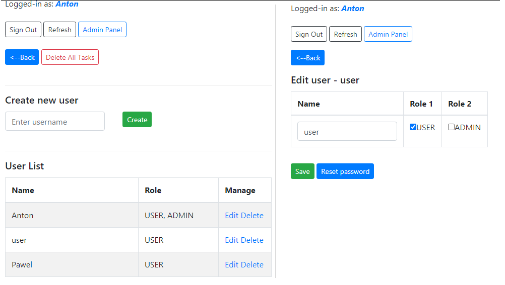

# Task Manager
> Application provides a possibility to group of users(some team) to manage tasks(via web interface) sent by a third party to a specific gmail mailbox.

## Table of contents
* [General info](#general-info)
* [Screenshots](#screenshots)
* [Technologies](#technologies)
* [Features](#features)
* [Status](#status)
* [Contact](#contact)

## General info
The idea of the project is based on my desktop application that I created in C# a few years ago for the company I worked for. The functionality has been significantly revised, improved, and migrated to the web. 
The main purpose and motivation is to improve my Java skills.

## Screenshots

## Technologies
* Java 8
* Spring Boot - version 2.2.2
* Spring Data JPA - version 2.2.2
* Spring Security - version 5.3.3
* Hibernate - version 5.4.9.Final
* Maven - version 3.6.1
* MySQL - version 5.1
* Freemarker - version 2.3.29
* Google API - version 1.23.0
* HTML
* CSS
* Java Script
* Bootstrap 4

## Features
List of features ready
* Authentication & authorization system
* When a new message(task) arrives in the mailbox, the user receives a notification on the main screen and can update the list getting a new task on it
* One of the two statuses available for the task - "Waiting" or "Processing"
* Tasks with the "Processing" status are marked with the name of the user who accepted them for processing
* Two global roles: USER, ADMIN
* USER's permissions: browse task list; check whether new tasks available; change task status from "Waiting" to "Processing" and vice versa;
* ADMIN's permissions: all USERs permissions + delete specific task from the list; delete all tasks from the list; create/update/edit user; change user's role; reset user's password

To-do list:
* Logging
* Create/delete/edit statuses via Admin Panel

## Status
Project is: _in progress_

## Contact
Created by Anton Kozhanov [deal.for at gmail.com] - feel free to contact me!
